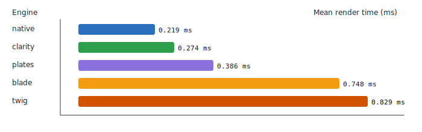

# Clarity DSL Template Engine


**A sandboxed, compiled template engine for Merlin** – Clarity compiles `.clarity.html` files into PHP classes that are cached on disk. Templates can only access variables passed to `render()` and registered filters; arbitrary PHP code is intentionally disallowed.

---

## Setup

`ClarityEngine` is the default view engine. Configure it in your bootstrap:

```php
use Merlin\AppContext;

$ctx = AppContext::instance();

$ctx->view()
    ->setViewPath(__DIR__ . '/../views')  // optional, defaults to "views" in the project root
    ->setLayout('layouts/main');          // optional default layout
```

To use plain-PHP templates instead, swap to `NativeEngine`:

```php
use Merlin\Mvc\Engines\NativeEngine;

$ctx->setView(new NativeEngine());
$ctx->view()->setViewPath(__DIR__ . '/../views');
```

### Configuration

| Method                                    | Description                                                              |
| ----------------------------------------- | ------------------------------------------------------------------------ |
| `setViewPath(string $path)`               | Base directory where templates are found                                 |
| `setLayout(?string $layout)`              | Default layout template (`null` disables the layout)                     |
| `setExtension(string $ext)`               | Override the file extension (default: `.clarity.html`)                   |
| `setCachePath(string $path)`              | Directory for compiled PHP files (default: `sys_get_temp_dir()/clarity`) |
| `getCachePath()`                          | Return the current cache path                                            |
| `flushCache()`                            | Delete all compiled files – useful during development                    |
| `addFilter(string $name, callable $fn)`   | Register a custom filter                                                 |
| `addFunction(string $name, callable $fn)` | Register a custom function                                               |
| `addNamespace(string $ns, string $path)`  | Register a named directory for template resolution                       |

---

## Template Syntax at a Glance

```
{{ expression }}          Output a value (auto-escaped)
{{ expression |> raw }}   Output raw HTML (no escaping; `raw` is a special marker that disables auto-escaping)
           Control flow, assignment, includes, inheritance
```

---

## Output Tags

Enclose any Clarity expression in double curly braces to print it:

```html
<p>Hello, {{ user.name }}!</p>
```

**Auto-escaping** is always applied: every output tag calls `htmlspecialchars()` automatically. To print raw HTML, pipe through `raw`:

```html
{# trusted HTML stored in a variable #}
<div>{{ body |> raw }}</div>
```

`raw` is a special compile-time marker handled by the Clarity engine. It acts as an identity within the filter pipeline and, when present anywhere in the chain, disables the automatic `htmlspecialchars()` wrap for the whole expression.

---

## Expressions

### Variable Access

Variables are accessed via dot notation or bracket notation. Direct PHP variables (`$name`) are forbidden.

```
user.name                 → $vars['user']['name']
items[0]                  → $vars['items'][0]
items[index]              → $vars['items'][$vars['index']]
a.b[c.d].e                → $vars['a']['b'][$vars['c']['d']]['e']
```

### Operators

| Clarity                          | PHP equivalent | Notes                |
| -------------------------------- | -------------- | -------------------- |
| `and`                            | `&&`           |                      |
| `or`                             | `\|\|`         |                      |
| `not`                            | `!`            |                      |
| `~`                              | `.`            | String concatenation |
| `==`, `!=`, `<`, `>`, `<=`, `>=` | same           |                      |
| `+`, `-`, `*`, `/`, `%`          | same           |                      |
| `true`, `false`, `null`          | same           |                      |

```twig

<span>Admin</span>


<p>{{ firstName ~ ' ' ~ lastName }}</p>
```

Registered template functions are allowed in expressions. Built-in `context()` and `include()` are always available, and user code may register additional functions via `addFunction()`. Arbitrary PHP function calls such as `strtoupper(name)` are still rejected at compile time.

### Collection Literals

Clarity supports array and object literals directly inside expressions:

```twig
{{ [1, 2, user.id] |> json |> raw }}
{{ { name: user.name, active: user.active } |> json |> raw }}
```

Object keys must be fixed identifiers or quoted strings.

### Spread Operator

Array and object literals support the spread operator:

```twig
{{ [1, ...items, 99] |> json |> raw }}
{{ { foo: "bar", ...payload } |> json |> raw }}
```

Spread is only valid inside array and object literals.

### Built-in Functions

Two Clarity functions are built in:

```twig
{{ context() |> json |> raw }}
{{ include("partials/card", { ...context(), title: "Hello" }) }}
```

- `context()` returns the current template variable array (`$vars`).
- `include(view, context = [])` renders another template dynamically and returns its rendered markup.
- `include()` resolves paths from the view base path or registered namespaces, just like `` and ``.
- Markup returned by `include()` is treated as safe by Clarity auto-escaping, even when stored via `` and rendered later.

---

## Filter Pipeline (`|>`)

Filters transform a value before it is output. Chain multiple filters with `|>`:

```twig
{{ user.name |> upper }}
{{ price |> number(2) }}
{{ createdAt |> date('d.m.Y') }}
{{ description |> trim |> upper }}
```

Filters with arguments use parentheses after the filter name:

```twig
{{ amount |> number(0) }} {# 0 decimal places #}
{{ timestamp |> date('H:i') }} {# format as time #}
```

### Built-in Filters

| Filter   | Signature                   | Description                                     |
| -------- | --------------------------- | ----------------------------------------------- |
| `trim`   | `(value)`                   | Remove leading/trailing whitespace              |
| `upper`  | `(value)`                   | `mb_strtoupper`                                 |
| `lower`  | `(value)`                   | `mb_strtolower`                                 |
| `length` | `(value)`                   | `strlen` for strings, `count` for arrays        |
| `number` | `(value, decimals = 2)`     | `number_format`                                 |
| `date`   | `(value, format = 'Y-m-d')` | Formats a Unix timestamp or `DateTimeInterface` |
| `json`   | `(value)`                   | `json_encode`                                   |

### Custom Filters

Register additional filters in your bootstrap:

```php
$ctx->view()->addFilter('currency', fn($v, string $sym = '€') =>
    number_format($v, 2) . ' ' . $sym
);

$ctx->view()->addFilter('excerpt', fn($v, int $len = 100) =>
    mb_strlen($v) > $len ? mb_substr($v, 0, $len) . '…' : $v
);
```

Use them in templates:

```twig
{{ product.price |> currency }}
{{ product.price |> currency('$') }}
{{ article.body |> excerpt(150) }}
```

---

## Lambda Expressions

The `map`, `filter`, and `reduce` filters accept a **lambda expression** or a **filter reference** as their callable argument. This keeps templates secure: arbitrary PHP callables cannot be injected through template variables.

### Lambda syntax

```
param => expression
```

The parameter name becomes a local variable bound to the current element. The body is a full Clarity expression — it can access outer template variables and even use the filter pipeline (`|>`).

```twig
{# Extract a field from every item #}
{{ users |> map(u => u.name) |> join(', ') }}
{# Keep only active items, then extract labels #}
{{ items |> filter(i => i.active) |> map(i => i.label) |> join(', ') }}
{# Apply a filter inside the lambda body #}
{{ tags |> map(t => t.name |> upper) |> join(', ') }}
{# Access an outer template variable inside the lambda #}
{{ words |> map(w => w ~ suffix) |> join(' ') }}
```

### Reduce and the implicit `value` parameter

`reduce` passes two arguments to its callable: the accumulator and the current element. Declare the accumulator name in the lambda; the current element is always available as `value`.

```twig
{# Sum a list of numbers (0 is the optional initial value) #}
{{ numbers |> reduce(sum => sum + value, 0) }}
{# Build a string #}
{{ words |> reduce(acc => acc ~ ' ' ~ value) }}
```

### Filter references

A quoted string resolves to a registered Clarity filter, allowing you to reuse existing filters as callbacks:

```twig
{# 'upper' is a built-in filter #}
{{ tags |> map("upper") |> join(', ') }}
{# Use a custom filter registered via addFilter() #}
{{ prices |> map("currency") |> join(', ') }}
```

> **Security note:** Only registered Clarity filters can be referenced this way. Arbitrary PHP function names are rejected at compile time.

---

## Control Flow

### If / Elseif / Else

```twig

<button>Add to cart</button>

<span>Out of stock</span>

<span>Unavailable</span>

```

### For Loops

**Iterate over a list:**

```twig
<ul>
  
  <li>{{ item.name }}</li>
  
</ul>
```

**Exclusive range** (`..`) – last value is not included:

```twig
 {{ i }} 
{# prints 1 2 3 4 5 6 7 8 9 #}
```

**Inclusive range** (`...`) – last value is included:

```twig
 {{ i }} 
{# prints 1 2 3 4 5 6 7 8 9 10 #}
```

**With a step:**

```twig
 {{ i }} 
{# prints 0 10 20 30 40 50 60 70 80 90 100 #}
```

Ranges can use variables:

```twig
 {{ i }} 
```

### Variable Assignment

```twig



<p>{{ total }} items for {{ label }}</p>
```

---

## Template Inheritance

Clarity implements block-based template inheritance. A child template extends a parent layout and overrides named blocks.

**Parent layout** (`layouts/main.clarity.html`):

```twig
<!DOCTYPE html>
<html>
  <head>
    <title>My App</title>
    
  </head>
  <body>
     
    <footer>&copy; My App</footer>
    
  </body>
</html>
```

**Child template** (`pages/home.clarity.html`):

```twig

Home – My App

<h1>Welcome, {{ user.name }}!</h1>

```

- Blocks not overridden in the child retain the parent's default content.
- Inheritance is resolved at **compile time** – no runtime overhead.
- Nesting is supported: a child layout may itself extend another parent.

---

## Includes

Embed another template inline using ``. The included file shares the current variable scope.

```twig


```

Included files are compiled and inlined at compile time. They do not create a separate render call.

Recursive include chains are rejected during compilation.

### Dynamic Include Function

Use `include()` when the target template or the include context must be decided dynamically at render time:

```twig
{{ include("partials/user_card", { role: "admin", ...context() }) }}
{{ include(selectedTemplate, context()) }}
```

Unlike ``, the `include()` function performs a separate render call at runtime and returns the rendered markup directly.

### Named Namespaces

Register a named directory and reference templates with the `namespace::path` syntax:

```php
$ctx->view()->addNamespace('admin', __DIR__ . '/../views/admin');
```

```twig
 
```

Dots and slashes are interchangeable as path separators:

```twig
 {# same as above #}
```

---

## Layouts via Controller

Use the view engine helpers in your controller as usual – `ClarityEngine` honors the same `ViewEngine` API:

```php
class ArticleController extends Controller
{
    public function showAction(int $id): string
    {
        $article = Article::findOrFail($id);

        // No layout for this response
        $this->view()->setLayout(null);
        return $this->view()->render('articles/show', [
            'article' => $article,
        ]);
    }
}
```

The `content` variable is automatically injected into the layout template when a layout is active (identical to `NativeEngine` behaviour).

---

## Caching

Compiled PHP classes are written to the cache directory and served from there on subsequent requests. OPcache picks them up transparently, so warm-path rendering requires no file I/O.

Cache files are **automatically invalidated** when any source file they depend on (the template itself, extended layouts, included partials) is modified.

```php
// Custom cache location
$ctx->view()->setCachePath('/var/cache/clarity');

// Flush during development when template changes are not being picked up
$ctx->view()->flushCache();
```

> **Tip:** In production, point the cache to a persistent directory outside `/tmp` and ensure the web server user has write access.

---

## Security Sandbox

Clarity templates have **no access to PHP**:

- Direct PHP variables (`$name`) are rejected at compile time.
- Function calls (`strtoupper(x)`) are rejected at compile time – use the filter pipeline.
- Statement delimiters (`;`), backticks, heredocs, and PHP open/close tags are disallowed in expressions.
- Objects passed to `render()` are automatically cast to arrays (via `JsonSerializable`, `toArray()`, or `get_object_vars()`), preventing method calls from inside templates.
- `map`, `filter`, and `reduce` only accept lambda expressions or filter references — passing a callable via a template variable is rejected at compile time.

---

**Benchmark Results**

The following micro-benchmark compares Clarity (compiled templates) with other popular PHP template engines using the `benchmarks` harness. Results were written to `benchmarks/view-engine/results-2026-03-07-004340.json` and `benchmarks/view-engine/results-2026-03-07-004340.csv`.

- **Context:** CLI run, PHP 8.3, OPcache CLI enabled for steady-state measurements; 10,000 iterations per engine.
- **Measured metrics:** warm render time (ms), per-iteration mean/median/p95 (ms), and peak memory.

**Summary (warmup, mean render time, ms)**

| Engine  | Warm (ms) | Mean (ms) | P95 (ms) |
| ------- | --------- | --------- | -------- |
| native  | 1.8808    | 0.2191    | 0.3162   |
| clarity | 0.7028    | 0.2744    | 0.3797   |
| plates  | 5.9563    | 0.3860    | 0.5624   |
| blade   | 28.4739   | 0.7479    | 1.0375   |
| twig    | 19.7515   | 0.8289    | 1.1061   |

You can find the full CSV/JSON outputs in the repository under `benchmarks/view-engine/` and an SVG visualization next to the results: [benchmarks/view-engine/results-2026-03-07-01.svg](../benchmarks/view-engine/results-2026-03-07-01.svg).



## Choosing Between ClarityEngine and NativeEngine

|                       | ClarityEngine _(default)_                                    | NativeEngine                             |
| --------------------- | ------------------------------------------------------------ | ---------------------------------------- |
| Template syntax       | Clarity DSL (`{{ }}`, ``)                               | Plain PHP (`<?= ?>`, `<?php ?>`)         |
| Sandboxed             | Yes                                                          | No                                       |
| Auto-escaping         | Always on by default                                         | Manual                                   |
| Compilation & caching | Yes                                                          | No                                       |
| Template inheritance  | `` / ``                              | require/include                          |
| Filter pipeline       | Built-in                                                     | Not built-in                             |
| Suitable for          | User-facing views, team projects, untrusted template authors | Full PHP control, existing PHP templates |

---

## Full Bootstrap Example

```php
<?php
require_once __DIR__ . '/../vendor/autoload.php';

use Merlin\AppContext;
use Merlin\Db\Database;
use Merlin\Http\Response;
use Merlin\Http\SessionMiddleware;
use Merlin\Mvc\Dispatcher;
use Merlin\Mvc\Router;

$ctx = AppContext::instance();

// Database
$ctx->dbManager()->set('default', fn() => new Database(
    'mysql:host=localhost;dbname=myapp', 'user', 'pass'
));

// ClarityEngine is the default – just configure it
$ctx->view()
    ->setViewPath(__DIR__ . '/../views')
    ->setLayout('layouts/main')
    ->setCachePath('/var/cache/clarity');

// Custom filters
$ctx->view()->addFilter('currency', fn($v) => '€ ' . number_format($v, 2));

// Routing & dispatching
$router = $ctx->router();
$router->add('GET', '/', 'IndexController::indexAction');

$dispatcher = new Dispatcher();
$dispatcher->setBaseNamespace('\\App\\Controllers');
$dispatcher->addMiddleware(new SessionMiddleware());

$route = $router->match(
    $ctx->request()->getPath(),
    $ctx->request()->getMethod()
);

if ($route === null) {
    Response::status(404)->send();
} else {
    $dispatcher->dispatch($route)->send();
}
```
